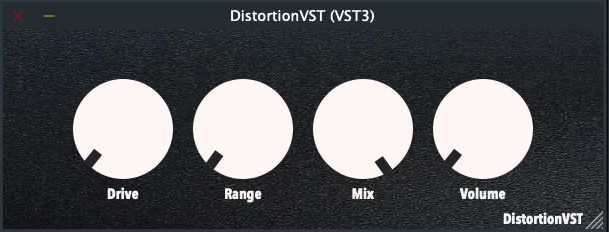
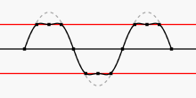
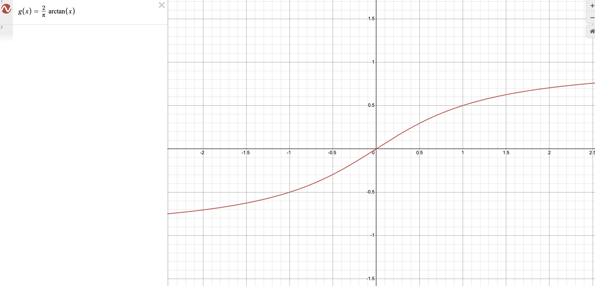

<!-- omit in toc -->

# Distortion VST

<!-- omit in toc -->

## An audio harmonic distortion plugin created with [JUCE](https://juce.com/)

<!-- PROJECT LOGO -->
 

  

  <h3 align="center">Distortion VST</h3>

  

     
    <a href="https://github.com/othneildrew/Best-README-Template"><strong>Explore the docs »</strong></a>
     
     
    <a href="https://www.youtube.com/watch?v=dQw4w9WgXcQ">View Demo</a>
    ·
    <a href="https://github.com/shyamal10/DistortionVST/issues">Report Bug</a>
    ·
    <a href="https://github.com/shyamal10/DistortionVST/issues">Request Feature</a>
  

<!-- omit in toc -->

## Contents

- [Introduction](#introduction)
- [Features](#features)
- [Manual](#manual)
  - [General](#general)
- [Technical](#technical)
  - [Design Approach](#design-approach)
  - [Overview](#overview)
    - [Mix](#Mix)
    - [Drive and Range](#Drive-and-Range)
    - [Digital Signal Procesing]()
- [References](#references)

## Introduction

This VST3/AU distortion plugin was developed with the aim of creating a high-quality distortion suitable for a diverse range of signals and applications. The minimalist GUI enhances usability and avoids screen clutter. The project served as a valuable learning experience, significantly advancing my understanding of digital signal processing and digital audio effects as well as the JUCE framework. Audio programming requires fast and effecient code as audio buffers are refreshed constantly, so this was a good learning experience for me. [A demonstration is available on YouTube.](https://www.youtube.com/watch?v=dQw4w9WgXcQ)

## Features

- Drive
- Range
- Mix
- Volume

## Manual

#### General

- **Drive:** The drive knob is adjusts the signal level (in dB) being introduced to the amplifying algorithm. More drive pushes the signal closer to the limiting reigion, introducing more distorted artifacts.

- **Range:** The range knob configures how much the drive knob is allowed to clip the signal. So increasing the range knob would increase the maximum drive value as well.

- **Mix:** The Mix knob enables you to mix between the dry and processed signal. This can be used for parallel processing.

- **Volume:** The volume knob adjusts the level of the signal leaving the distortion algorithm, and could be applied as a general output volume slider.

## Technical

### Design Approach

Audio distortion effects are typically done by clipping the signal. Clipping refers to pushing a signal past its maximum, which shears off the peaks and troughs of the waveform. Clipping is a nonlinear process that produces frequences that was not present originally in the input audio signal. Some of these frequencies may be harmonic overtones, which are multiples of the signals original frequencies.

The term soft clipping occurs when the signal is gradually flattened past the hard limitng range. This creates a number of higher harmonics which share a harmonic relationship with the original tone and frequencies. Hard clipping flattens the peaks abruptly which results in higher power in higher harmoincs. As clipping increaes the signal may be reminisent of more of square wave, which has odd harmonics, this typically sounds harsh.

We can use various functions such as _arctan_(x) which has more smoother transitions past the limit instead of a hard limit value. The specific function that was used was the following:

    g(x) = 2/π * arctan(x)

The waveform looks like this:

So instead of a hard limiting which distorts the signal in a harsh way, this function can be applied to smoothly distort the peak/trough values in the incoming audio signal. This function is helpful too because of its aymptotic nature with ranges from [-1, 1].

### Overview

A basic distortion diagram:

Lets take a look at the components.

#### Mix

The mix knob blends how much of the distortion is mixed in with original waveform so we need to keep track of the unaltered original signal, this can be done by initiating a new variable _cleansig_.

`float cleanSig = *channelData;`

#### Drive and Range

The _Drive_ and _Range_ parameters are interconnected. As the range determines how much of the incoming signal can be increased we can simply apply that to the drive signal as follows. The range can be applied as follows:

`*channelData *= drive * range;`

#### Digital Signal Processing

The nonlinear processing can be applied as follows:

`*channelData = (((((2.f / juce::MathConstants<float>::pi) * atan(*channelData)) * mix) + (cleanSig * (1.f/ mix))) / 2) * volume;`

The channelData variable holds the audio buffer values coming from the sound card. This block of data is being processed (in general case) at sample rate of 44.1kHz with 512 buffer size would be around 86 times a second (determined with sample rate divided by buffer size). This is a reasonable buffer rate for the processor to process the data, instead of the sample rate which is quite fast.

The function is applied which we saw in the [Design Approach](#Design_Approach) section. The distorted signal is being multipled by the mix value. Implementing the mix functionality means adding the average between the clean signal and the mix parameter. Finally this is all scaled with the volume at the end which scales the amplitude to some value set by the user.

The audio processing block with C++ implementation::

    void DistortionVSTAudioProcessor::processBlock (juce::AudioBuffer<float>& buffer, juce::MidiBuffer& midiMessages)
      {
        juce::ScopedNoDenormals noDenormals;
        auto totalNumInputChannels  = getTotalNumInputChannels();
        auto totalNumOutputChannels = getTotalNumOutputChannels();

        for (auto i = totalNumInputChannels; i < totalNumOutputChannels; ++i)
            buffer.clear (i, 0, buffer.getNumSamples());

        // Get raw parameter values
        auto drive = apvts.getRawParameterValue("drive")->load();
        auto range = apvts.getRawParameterValue("range")->load();
        auto mix = apvts.getRawParameterValue("mix")->load();
        auto volume = apvts.getRawParameterValue("volume")->load();

        for (int channel = 0; channel < totalNumInputChannels; ++channel)
        {
            auto* channelData = buffer.getWritePointer (channel);

            for (int sample = 0; sample < buffer.getNumSamples(); sample++)
            {
                float cleanSig = *channelData;

                *channelData *= drive * range;
                // Distortion function
                *channelData = (((((2.f / juce::MathConstants<float>::pi) * atan(*channelData)) * mix) + (cleanSig * (1.f/ mix))) / 2) * volume;

                channelData++;
            }

        }
      }

This function is continously called throughout the processing of the incoming audio block.

## References

- (1) https://www.youtube.com/watch?v=iNCR5flSuDs&pp=ygUVanVjZSBwbHVnaW4gdHV0b3JpYWwg
- (2) https://www.izotope.com/en/learn/what-is-distortion-in-music-when-and-how-to-use-it.html
- (3) https://www.allaboutcircuits.com/technical-articles/what-is-it-about-audio-distortion/
- (4) https://ccrma.stanford.edu/~orchi/Documents/DAFx.pdf

[1]: https://www.youtube.com/watch?v=iNCR5flSuDs&pp=ygUVanVjZSBwbHVnaW4gdHV0b3JpYWwg
[2]: https://www.izotope.com/en/learn/what-is-distortion-in-music-when-and-how-to-use-it.html
[3]: https://www.allaboutcircuits.com/technical-articles/what-is-it-about-audio-distortion/
[4]: https://ccrma.stanford.edu/~orchi/Documents/DAFx.pdf
